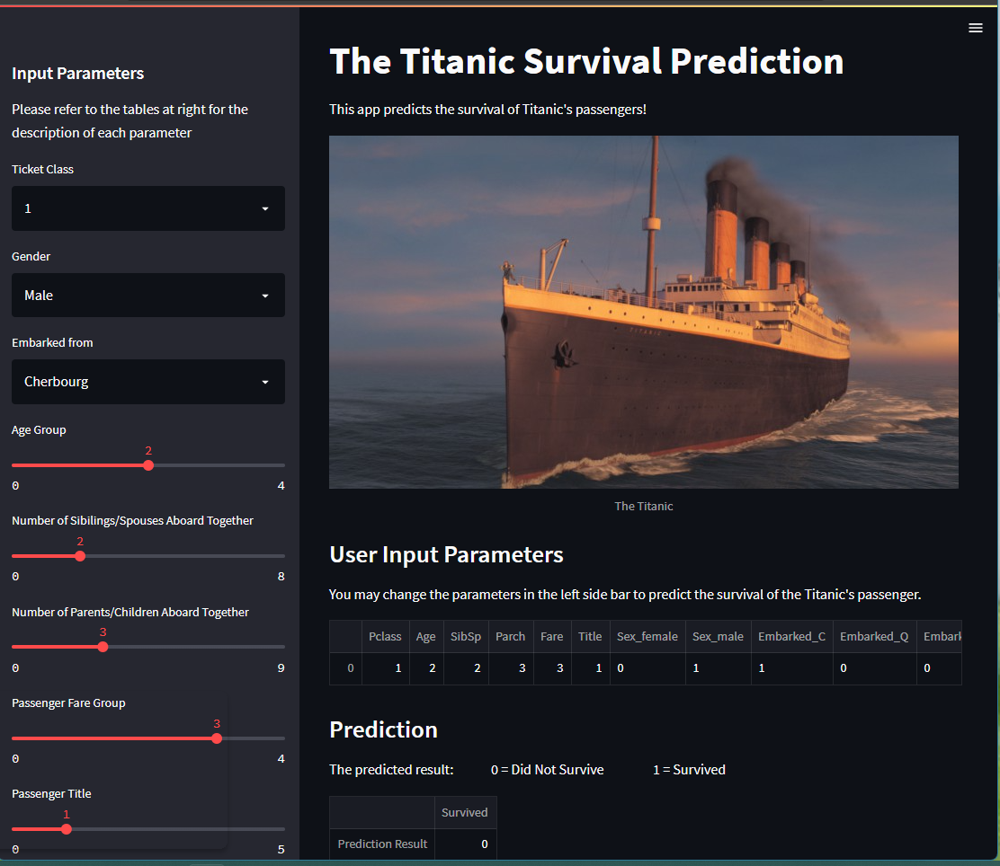

# TITANIC SURVIVAL PREDICTION APP 

This is an App created to deploy the Titanic Surival Prediction's trained model.
Please refer to the "titanic-survival-prediction" repository to view the coding of model training. 
[Link to repository](https://github.com/liangchua/titanic-survival-prediction)

### THE OBJECTIVE
Create an App that deploy the trained Random Forest Classifier for Titanic Survival Prediction and let the User to play with the input parameters for new prediction.

### THE DESCRIPTION OF UPLOADED FILES
|File Name|Description|
|---------|-----------|
|Procfile|A file created to ask the Heroku to read the "requirements.txt" and "setup.sh"|
|Titanic_2.jpg|An image of Titanic|
|minmax.pkl|The exported MinMaxScaler model from "titanic-survival-prediction"|
|rand_rf_model.pkl|The exported Random Forest Classifier from "titanic-survival-prediction"|
|requirements.txt|The text file recorded the version of python packages used in creating this App|
|setup.sh|The code for setting up the streamlit|
|titanic-deployment-app-scroll-1.png|An image display the expand of features description|
|titanic-deployment-app-scroll-2.png|An image display the expand of parameters' tables|
|titanic-deployment-app.png|An image display the main part of the App|
|titanic-deployment.py|The main coding file to create this App|

### THE APP
This App was created using Streamlit package in Python and publish using Heroku. 
Please click the link to play with the App. It might take about 15-30 seconds to load the App. 
[Welcome to the App](https://titanic-deployment-app.herokuapp.com/)

The following figures show the display of the App created:

Thank you for taking the time to read my work !!!
